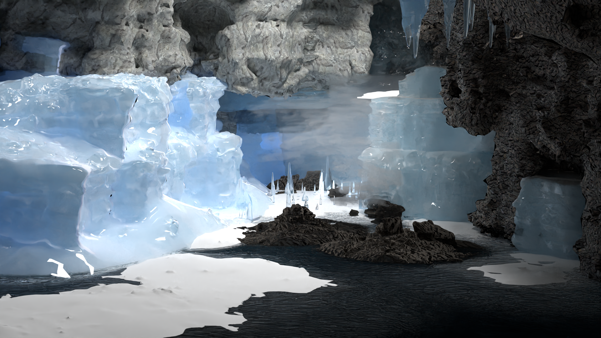

# Advanced Computer Graphics - Project Report

This repository contains the web-based report for my Advanced Computer Graphics project at ETH Zurich.

**Theme:** The More You Look  
**Focus:** Subtleties of the silent ice world

[View the full report](https://sandrimaddie.github.io/ethz-cg23-project-report/)

## Features Implemented

- Heterogeneous Participating Media
- Emissive Participating Media
- Anisotropic Phase Function
- Intel Denoising
- Images as Textures
- Bump Mapping

## About the Project

This project explores the subtleties of a silent ice world, creating an environment that makes the viewer feel welcomed and peaceful while introducing otherworldly hidden secrets. The rendering focuses on luminous effects, atmospheric lighting, and the interplay between natural beauty and mystical elements.
